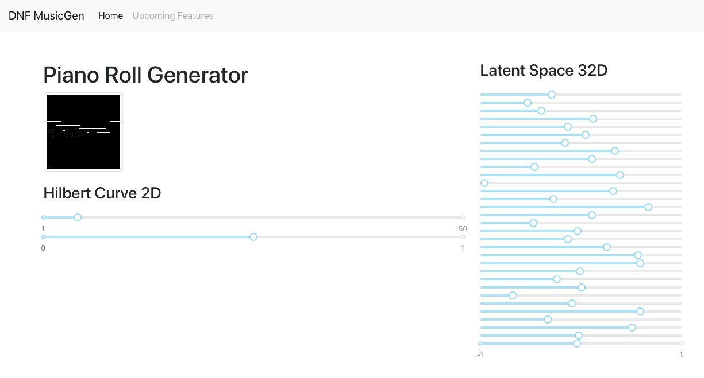

# DNF-music-gen
DeepNeuro Feedback Music Generator 

## Demo

## User Guide
## Setup 
- In Frontend `cd react-front`
    - `npm install`
    - `npm run build` 
- In Backend `cd flask-back`
    - `python3 main.py` 
    - then access from browser via `http://127.0.0.1:5000/`

## Developer Guide
### Project Setup (Developer Only)
- make React project
- `npx create-react-app my-app`
- `git add .; git commit ` before eject
- `sudo npm run eject`
- start server: `python3 server.py`

### `flask-back/` 
Flask backend 
- `cvae/` = Convolutional VAE API by Cattalyya
    - `models/` = trainned model achieved by [`CVAE-training-bin-1channel-batchnorm.ipynb`](https://github.com/clairefuzzyelephant/melody-vae/blob/master/cvae/CVAE-training-bin-1channel-batchnorm.ipynb) from [melody-vae Github Repos](https://github.com/clairefuzzyelephant/melody-vae/tree/master/)
    - `imgs/` = predicted piano rolls
    - `static/` = auto gen from front-end template builder
    - `model.py` = CVAE model class
    - `piano_roll_utils.py` = piano roll conversion utils among images, matrix, torch, numpy, midi etc.
    - `main.py` = routers accepted connection from POST/GET requests
 
- `hilbert/` = Hilbert API 
    - `HilbertExplorer.py` = Explorer class by Felicia

### `react-front/`
- `public/index.html` = index template
- `src/`
    - `css/`
    - `js/` contains different react components for interactive piano roll controller and predictors
        - `PredictedImage.js` = predicted piano roll display
        - `StepSlider.js` = step slider component
    - `index.js` = main render and logic of index.html

### External Libraries
- [Slider](https://github.com/react-component/slider)

### TODOs
* [ ] show current value of each slider
* [x] make only one axis label for all sliders
